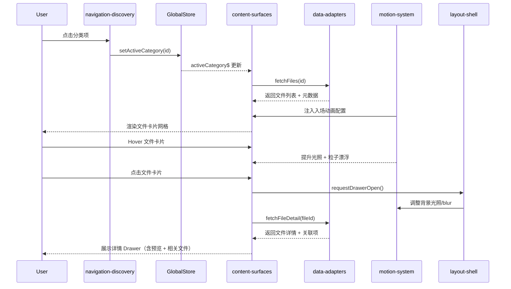

# 前端 UI 实现方案（NUAA 文件分类平台）

更新日期：2025-10-26
适用范围：`web/` React + Vite 前端工程

---

## 1. 实现目标概述

- **对齐视觉体验**：完全遵循《前端 UI/UX 设计文档》中定义的硬核工业科幻基调，保留战术终端质感、装甲化面板、冷光描边与扫描动效。
- **工程解耦**：通过模块化目录与独立状态管理，确保组件之间松耦合、易于维护。
- **一致的交互语言**：统一处理 Structure/Signal/Motion/Texture/Light 五个战术终端维度，保证桌面与移动端体验一致。
- **可测试性**：数据流与动效统一抽象，支持 Storybook/Chromatic 截屏回归与组件单测。

> **核心约束**：不以“简化视觉”为实现捷径；若需调整设计，仅用于提升一致性或编程落地性且保持质感。所有组件边角需保持 0 半径（直角切削）。

---

## 2. 高层架构与目录规划

```
web/
├─ docs/                      # 模块规范文档（本方案指定待创建空白文档）
│  ├─ layout-shell.md          # 布局与响应式策略
│  ├─ navigation-discovery.md  # 导航 & 分类树交互
│  ├─ content-surfaces.md      # 文件卡片、详情面板
│  ├─ search-filter.md         # 搜索与筛选体验
│  ├─ motion-system.md         # 动效、粒子、视差实现
│  ├─ theming-tokens.md        # 主题、配色、材质
│  ├─ accessibility-i18n.md    # 无障碍与国际化
│  └─ data-adapters.md         # 与后端接口契合的数据适配
├─ src/
│  ├─ app/
│  │  ├─ App.tsx               # 应用根组件
│  │  ├─ routes/               # 路由定义
│  │  └─ providers/            # 全局上下文提供者
│  ├─ modules/                 # 下述解耦模块（按域划分）
│  ├─ components/              # 通用原子与分子组件
│  ├─ hooks/                   # 复用的逻辑 hook
│  ├─ stores/                  # Zustand/Jotai 状态容器
│  ├─ services/                # API client、缓存策略
│  ├─ themes/                  # 设计 Token、CSS 变量
│  ├─ assets/                  # SVG、噪点纹理、粒子脚本
│  └─ styles/                  # 全局样式、重置、字体
└─ tests/                      # 组件 & 集成测试
```

> 上述 `docs/*.md` 为本次方案指定的空白文档，后续执行时需逐个创建并填充设计细则。

---

## 3. 解耦模块与责任矩阵

| 模块代号               | 对应目录             | 职责                                    | 关联文档                       | 依赖             | 被依赖           | 关键实现备注                                                |
| ---------------------- | -------------------- | --------------------------------------- | ------------------------------ | ---------------- | ---------------- | ----------------------------------------------------------- |
| `layout-shell`         | `modules/layout`     | 构建双栏布局、响应式断点、顶栏/底栏联动 | `docs/layout-shell.md`         | 主题、导航       | 所有页面         | 利用 CSS Grid + container query，实现导航缩放过渡           |
| `navigation-discovery` | `modules/navigation` | 分类树、快捷入口、抽屉交互              | `docs/navigation-discovery.md` | 数据适配、动效   | 分类页、搜索页   | 折叠动画使用 Framer Motion，支持键盘导航                    |
| `content-surfaces`     | `modules/content`    | 文件卡片、推荐位、详情 Drawer           | `docs/content-surfaces.md`     | 主题、动效、数据 | 分类页、详情页   | 装甲化面板采用金属纹理叠加 HUD 网格，配冷光描边             |
| `search-filter`        | `modules/search`     | 全局搜索条、结果页、过滤 Sidebar        | `docs/search-filter.md`        | 数据适配、动效   | 搜索页、TopBar   | 采用虚拟滚动优化大结果集，过滤器组件化                      |
| `motion-system`        | `modules/motion`     | 动效曲线、视差、骨骼/粒子封装           | `docs/motion-system.md`        | 主题             | 所有视觉模块     | 建立 MotionProvider 注入 timeline；粒子基于 regl/three-lite |
| `theming-tokens`       | `themes/`            | 颜色、字体、光照、高亮 Token 定义       | `docs/theming-tokens.md`       | 无               | 所有模块         | 使用 CSS Variables + Tailwind config 扩展                   |
| `accessibility-i18n`   | `modules/a11y`       | 焦点管理、ARIA、语言切换                | `docs/accessibility-i18n.md`   | 主题、导航       | 全局             | 建立 useFocusRing、语言包（zh-CN/en-US）                    |
| `data-adapters`        | `services/adapters`  | 对接 Fastify API，缓存、错误处理        | `docs/data-adapters.md`        | 后端 API         | 导航、内容、搜索 | 利用 react-query/SWR，提供缓存策略与骨架状态                |

---

## 4. 模块间交互关系

1. **App 初始化**

   - `layout-shell` 初始化响应式监听与光照模式。
   - `theming-tokens` 注入 CSS 变量至 `<html>`。
   - `motion-system` 注册滚动/视差管理器。

2. **分类浏览流程**

   - `navigation-discovery` 通过 `data-adapters` 拉取分类树 → 分发选中状态至全局 store。
   - `content-surfaces` 监听选中分类 ID，调用 `data-adapters` 取回文件列表。
   - `motion-system` 为文件卡片提供 hover/入场动画。

3. **搜索流程**

   - `search-filter` 将关键字、筛选项同步至 URL Query。
   - `data-adapters` 去重发起请求（含缓存 key）。
   - 结果列表复用 `content-surfaces` 的卡片渲染，但通过 prop 注入“搜索模式”样式。

4. **详情 Drawer**
   - `content-surfaces` 的卡片触发 `motion-system` 预加载粒子；
   - `data-adapters` 获取文件详情 + 关联文件；
   - `layout-shell` 锁定 body 滚动并降低背景光照，强调浮层。

---

## 5. 优先级路线图

| 阶段        | 目标             | 含关键任务                                                      | 预估工期 |
| ----------- | ---------------- | --------------------------------------------------------------- | -------- |
| **Phase 0** | 项目基础搭建     | Vite 配置、路由、Tailwind/Tokens、全局 Provider                 | 2 天     |
| **Phase 1** | 基础框架         | `layout-shell`、`theming-tokens`、TopBar/Sidebar 骨架、API 适配 | 4 天     |
| **Phase 2** | 核心展示         | `content-surfaces` 文件卡片 + 列表、基础动效、骨架屏            | 5 天     |
| **Phase 3** | 搜索体验         | `search-filter`、结果页、过滤控件、URL 状态同步                 | 4 天     |
| **Phase 4** | 详情与高级动效   | Drawer、视差、粒子、骨骼动画、背景模糊优化                      | 5 天     |
| **Phase 5** | 可访问性与国际化 | 焦点管理、屏幕阅读器支持、英文版 UI                             | 3 天     |
| **Phase 6** | 打磨 & 质量      | Storybook、E2E 测试、性能调优、设计联调                         | 4 天     |

---

## 6. 实现细节建议（保持工业硬核质感）

- **材质实现**：使用 `linear-gradient` + 噪点贴图模拟拉丝金属，配合 `background-image: repeating-linear-gradient(...)` 输出拼缝；低性能设备降级为纯色+描边。
- **灯带与描边**：通过 `box-shadow` + `before/after` 双层描边生成冷光条；Hover 状态加强外描边亮度并追加扫描线动画。
- **HUD 网格**：在主容器添加 `background-image: linear-gradient` 生成 8px 网格线，使用 `mix-blend-mode: screen` 控制亮度。
- **粒子/干扰线**：`motion-system` 暴露 `useHudNoise` Hook，默认渲染低频干扰线；移动端降级为伪元素动画。
- **景深控制**：详情 Drawer 打开时，以 `backdrop-filter: brightness(0.6)` + 垂直渐变取代模糊，营造舱壁光路。
- **动效时序**：统一采用 `--motion-fast (140ms)`、`--motion-medium (210ms)`、`--motion-slow (320ms)`，动画曲线 `cubic-bezier(0.3, 1, 0.4, 1)` 表现磁吸停靠。

> 以上策略强化战术终端氛围，并提供降级路径以保证性能。

---

## 7. Mermaid 时序图（分类浏览 → 文件详情）



---

## 8. 配套文档清单（需创建的空白文件）

| 文件名                         | 建议位置    | 用途                               |
| ------------------------------ | ----------- | ---------------------------------- |
| `docs/layout-shell.md`         | `web/docs/` | 布局、断点、容器设计规范           |
| `docs/navigation-discovery.md` | `web/docs/` | 分类树/导航动效、可访问性          |
| `docs/content-surfaces.md`     | `web/docs/` | 卡片、详情、推荐区的视觉与交互细节 |
| `docs/search-filter.md`        | `web/docs/` | 搜索框、过滤器、结果页结构         |
| `docs/motion-system.md`        | `web/docs/` | 视差、粒子、动效 API 定义          |
| `docs/theming-tokens.md`       | `web/docs/` | 颜色、字体、光照 Token 表          |
| `docs/accessibility-i18n.md`   | `web/docs/` | 焦点、ARIA、语言切换规范           |
| `docs/data-adapters.md`        | `web/docs/` | API 契约、缓存策略、错误处理       |

---

## 9. 工程协作流程

1. **Kick-off**：设计师在 Penpot/Figma 输出页面与组件；工程端对照本方案创建空白文档并补充技术细节。
2. **Design Tokens 落地**：在 `theming-tokens` 中同步颜色、阴影、动效变量，与 Tailwind 配置关联。
3. **组件开发顺序**：严格遵循阶段路线图，确保基础布局 → 内容 → 动效逐层叠加。
4. **验证机制**：
   - Storybook 组件态预览
   - Playwright E2E（分类浏览、搜索、详情）
   - Lighthouse & Web Vitals 监控
5. **设计联调**：每阶段完成后，与设计师核对光照、材质、交互细节；必要时记录在 docs 对应文件中。

---

## 10. 后续迭代建议

- 建立 `design-tokens.json` 与后端共享色值/字体，方便多端协同。
- 调研骨骼动画与粒子效果的性能基线，在高帧率需求界面采用 requestAnimationFrame throttle。
- 预留自定义主题机制，支持夜间模式或无障碍高对比主题。
- 与数据团队合作扩展“推荐算法”接口，为首页推荐区提供动态权重。

---

> 本文档定义了 UI 实现的技术蓝图及各模块协作方式。完成后续 docs 填写与任务拆解，可作为前端实现的主工程规约。
