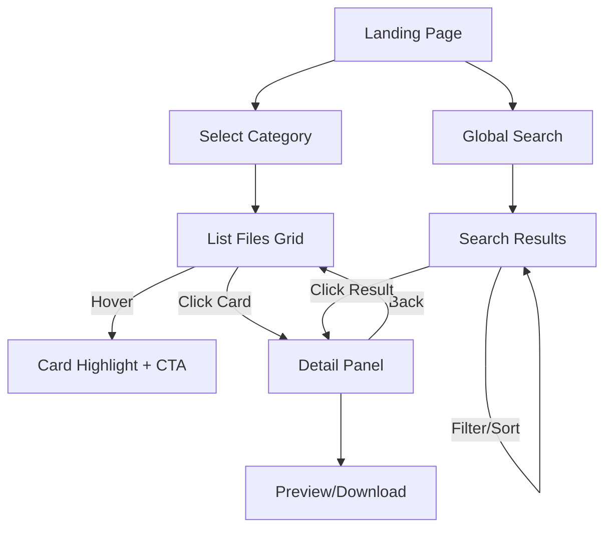

# 前端 UI/UX 设计文档（NUAA 文件分类平台）

更新日期：2025-10-26
适用范围：`web/` React + Vite 前端

## 1. 设计目标与用户场景

- **目标用户**：NUAA 新生、在校生、教师（快速获取课程资料、指南、资源）。
- **核心任务**：
  1. 浏览分类树并快速定位资料。
  2. 通过文件卡片了解内容要点并决定下载/预览。
  3. 搜索跨分类文件并过滤结果。
- **关键体验指标**：
  - 首屏加载 < 2s（PC 在优先网络）。
  - 用户 2 次内交互触达目标文件。
  - 视觉层级清晰、可感知的深度和动效引导。

## 2. 视觉设计基调（Fluent + 赛博科技风融合）

结合微软 Fluent（Light/Depth/Motion/Material/Scale）与参考资料中的扁平化深度表现：

| Fluent 维度 | 视觉表达策略 | 页面落点 |
|-------------|--------------|----------|
| Light       | 定向光 + 光晕强调主体，卡片 hover 时提升亮度。 | 顶部导航、主面板 |
| Depth       | 背景亚克力模糊 + 多层卡片投影（柔软外阴影 + vignette） | Sidebar、内容面板 |
| Motion      | 进入/切换时使用轻微 parallax、fading，局部 hover 缩放。 | 分类展开、文件卡片 |
| Material    | 亚克力面板（模糊 + 噪点），按钮与标签使用细腻 grain。 | 过滤条、弹窗、搜索框 |
| Scale       | 字体与间距的黄金比例（1:1.25），重点元素大尺度展示。 | 英文副标题、Hero 区域 |

**赛博/工业风元素**：
- 颜色：冷色系主色（#1E2A4A）、高亮警戒色（#8BFFB0 / #FFD166）。
- 字体：中文「思源黑体」，英文辅以无衬线等距风格 `Bender`（备选 `Roboto Mono`）。
- 图形：网点/粒子背景、粗条纹遮罩、无人机/线路插图（SVG）。

## 3. 布局与响应式

### 3.1 页面结构（Desktop ≥ 1280px）

```
┌───────────────────────────────────────────────┐
│ 顶部导航（Logo + 搜索 + 快捷）                │
├───────────────┬───────────────────────────────┤
│ 侧栏（Acrylic）│ 主内容（分类 / 列表 / 详情） │
│ 分类树          │ - Hero / Info Bar           │
│ - 分组折叠      │ - 内容卡片网格 3~4 列       │
│ - 图标/统计     │ - 详情 / 预览 Pane          │
├───────────────┴───────────────────────────────┤
│ 底栏（版权 / 反馈）                           │
└───────────────────────────────────────────────┘
```

### 3.2 Tablet & Mobile

- Tablet：侧栏收缩为抽屉；主内容改为 2 列网格；顶部导航保留搜索。
- Mobile：Tab + Bottom Sheet 模式；分类树以分组列表展开；文件列表单列卡片；搜索浮层覆盖。

## 4. 组件设计

### 4.1 顶部导航（TopBar）

- 背景：半透模糊 + vignette。
- 元素：Logo、站点名、搜索框（内含 placeholder、快捷筛选）、“反馈”按钮。
- 动画：滚动时缩小高度并加阴影。

### 4.2 分类侧栏（Category Sidebar）

- 样式：Acrylic 板材 + 噪点 / 内阴影。
- 交互：
  - 一级分类卡片（图标、名称、计数）。
  - 点击展开二级列表（滑动+淡入）。
  - 当前选中高亮 + 左侧竖条。

### 4.3 文件卡片（File Card）

| 状态 | 样式 |
|------|------|
| 默认 | 轻微浮起，标题 + 标签 + 核心元数据（大小/时间）。 |
| Hover | 光线提升、Y 轴 4px 浮动、背景粒子轻微移动。 |
| Selected | 高亮边框（光晕）、显示摘要/按钮。 |

内容结构：
- 左：文件类型图标（动态 Icon）。
- 中：标题、摘要（两行截断）、标签（课程/年级）。
- 右：辅助操作（下载、预览、收藏候选）。

### 4.4 文件详情面板（Overlay/Drawer）

- 模态：右侧滑入 Drawer（Desktop）/全屏（Mobile）。
- 背景：更高层级的模糊 + vignette。
- 内容：标题、路径、元数据表、预览（PDF 内嵌 / 外链）、同目录文件列表（列表样式）。

### 4.5 搜索模块

- 全局搜索框：渐入动画、背景散点遮罩。
- 搜索结果页：关键字高亮、左侧过滤器（分类、类型、时间）、右侧结果列表。
- 交互：敲击回车默认“在所有分类内搜索”；提供“仅当前分类”快捷。

### 4.6 动画与交互动效

- 分类树：展开 150ms ease-out，闭合 120ms ease-in。
- 卡片 hover：scale(1.02)、阴影增强、背景粒子转动。
- 页面切换：淡入淡出 + parallax（背景缓慢移动）。
- 按钮：点击时产生短暂亮度/凹陷效果（拟物简化）。

## 5. 信息层级与视觉指南

| 图层 | 元素 | 描述 |
|------|------|------|
| L0 背景 | 背景写真/网点 + vignette | 低对比度，统一色调 |
| L1 支撑层 | Sidebar、主面板 | 半透 + 模糊，建立层次 |
| L2 关键内容 | 文件卡片、详情面板 | 高对比、光照强调 |
| L3 强调 | Hover/活动状态 | 高亮描边、粒子/光斑 |
| L4 反馈 | Toast、加载状态 | 动画持续 < 400ms |

色彩参考：
- 主色：#1E2A4A（深蓝）、#27375D。
- 高亮：#8BFFB0（荧光绿）、#FFD166（焦糖黄）。
- 中性色：#F4F6FB（背景光）、#A3B3D6（分隔线）。
- 警示：#FF4D6D（错误）、#FF9F1C（警告）。

## 6. 页面模版

### 6.1 首页（推荐 + 快捷导航）

- Hero：背景视差 + 简短介绍 + 快速入口卡片。
- 今日推荐：横向滚动卡片（含交互动画）。
- 热门分类：卡片排布 + 添加 vignette 边框。
- 快捷功能：按钮区（“上传建议”、“更新日志”）。

### 6.2 分类页

- 左：分类树（可折叠）。
- 右：分类信息条（名称、描述、统计）。
- 文件网格：3-4 列，按热度/时间排序。
- 工具列：筛选（文件类型、更新时间、标签）、搜索框、排序器。

### 6.3 文件详情页

- Hero：文件缩略 + Title + 面包屑。
- 主：元数据 + 下载/预览 + 摘要 + 相关文件列表。
- 右（或底部）：补充信息（标签、课程简介）。
- 背景：焦距控制 + 模糊前景（Out of focus framing）。

### 6.4 搜索结果页

- 顶部：搜索结果说明，关键字高亮。
- 布局：左侧过滤器（抽屉），右侧结果列表。
- 结果卡片：包含匹配摘要、来源分类。

## 7. 互动细节与微动效

- **Loading skeleton**：使用线性渐变 shimmer，保持科技感。
- **Hover sound (可选)**：轻量电子音（可配置）。
- **空态**：用几何形状/网点插画 + 文案 + CTA。
- **错误页**：模糊背景 + 亮色 CTA 重试。

## 8. 可访问性与国际化

- 对比度 ≥ 4.5:1；主文本至二级背景保持足够亮度差。
- 字体可缩放，布局需在 125% 下保持易读。
- 支持中英双语：UI 文案抽离至 `i18n` 模块，英文字体使用 `Bender` / `Roboto Mono`。
- 键盘导航：焦点状态有高亮描边 + 阴影。

## 9. 资源与实现建议

- 样式层：Tailwind + 自定义样式（保留 Fluent 组件）。
- 图标：Fluent System Icons + 自制线框 SVG。
- 背景：SVG 噪点 / 粒子 + CSS filter（blur/brightness）。
- 材质效果：CSS `backdrop-filter: blur(12px)` with gradients & noise PNG。
- 动效：CSS Transition / Framer Motion（React）实现。

## 10. 交互流程示意（Mermaid）



## 11. 迭代路线（优先级）

| 优先级 | 实现项 | 说明 |
|--------|--------|------|
| P0 | 基础布局/组件（TopBar、Sidebar、Cards）、浅色主题 | 首批 UI 实现，配合现有后端 |
| P1 | 动效 & 材质加强（模糊、粒子、hover） | 增强质感与差异化 |
| P1 | 搜索页、过滤控件 | 功能完善 |
| P2 | 细粒度交互（骨骼动画、粒子增强）、音效 | 品牌沉浸感 |
| P2 | 暗色主题、个性化（收藏/历史） | 后续扩展 |

## 12. 交付清单与合作指引

- 设计稿（Figma / Penpot）包含：主页、分类、详情、搜索、404。
- UI Kit：按钮、标签、卡片、导航等组件的状态说明。
- 动效规格：持续时间、曲线、触发条件。
- 与前端协作：组件命名、变量（颜色、间距、字体）、断点定义。

---

**附注**：在实现阶段优先保障性能与可访问性；材质与动效在桌面端逐步增强，移动端适度简化以确保流畅度。