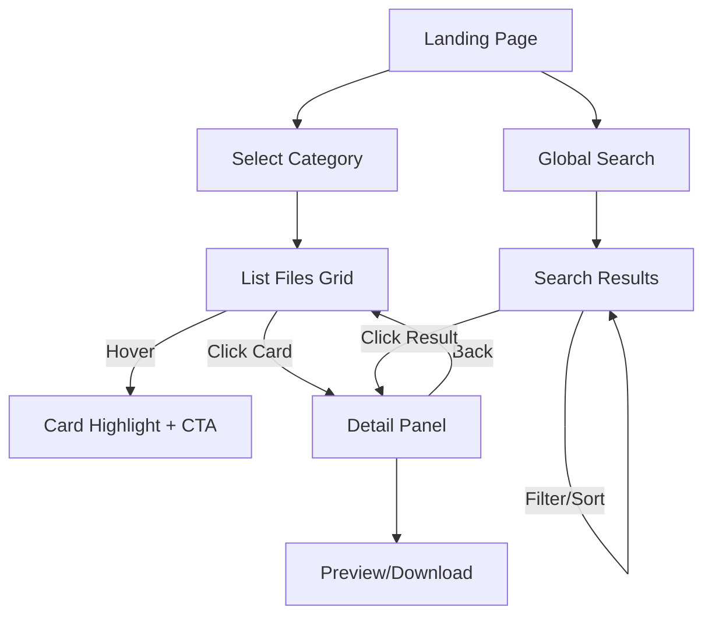

# 前端 UI/UX 设计文档（NUAA 文件分类平台）

更新日期：2025-10-26
适用范围：`web/` React + Vite 前端

## 1. 设计目标与用户场景

- **目标用户**：NUAA 新生、在校生、教师（快速获取课程资料、指南、资源）。
- **核心任务**：
  1. 浏览分类树并快速定位资料。
  2. 通过文件卡片了解内容要点并决定下载/预览。
  3. 搜索跨分类文件并过滤结果。
- **关键体验指标**：
  - 首屏加载 < 2s（PC 在优先网络）。
  - 用户 2 次内交互触达目标文件。
  - 视觉层级清晰、可感知的深度和动效引导。

## 2. 视觉设计基调（硬核工业科幻）

参考《明日方舟》《少女前线》世界观中的战术终端与 DJI、SpaceX 等硬件科技企业的舱内 UI，采用 **硬核工业/军武面板语言**：

- **无圆角（Zero Radius）**：所有面板、按键、卡片均以切削感直角呈现，强调模块化装甲板拼接感。
- **材质层次**：磨砂钛合金 + 碳纤维纹理，辅以警示条纹、铭牌编号、微弱噪点，强化“战术终端”氛围。
- **光感**：高对比定向光＋冷色描边，结合低频脉冲呼吸光，突出交互热点；背景使用分段式面板光斑而非柔和模糊。
- **信息布局**：采用 HUD 风格网格、坐标轴、数据标签，主视觉保留强烈的纵横线与编号系统。
- **动效准则**：机械滑轨/磁吸式反馈，节奏控制在 120–240ms，配合轻微震动感的弹性曲线。

| 工业维度  | 表达策略                                         | 页面落点                        |
| --------- | ------------------------------------------------ | ------------------------------- |
| Light     | 机械边缘高亮＋背板冷色光带，Hover 时加粗采光线条 | 顶部导航、按钮、活跃卡片        |
| Structure | 分段装甲板、螺钉/铭牌装饰、无圆角拼缝            | LayoutShell、Sidebar、卡片边框  |
| Motion    | 线性推进、磁吸吸附、HUD 扫描线                   | 分类展开、卡片悬停、详情 Drawer |
| Signal    | 警示色条（工业黄、航空蓝）、编号标签             | CTA、状态提示、统计模块         |
| Texture   | 细腻金属拉丝/碳纤维、低噪点、数字网格            | 背景层、按钮填充、卡片底纹      |

推荐字体组合：中文仍以「思源黑体」为主，英文辅以 `Roboto Mono` / `Space Grotesk`，强调战术终端排版。

## 3. 布局与响应式

### 3.1 页面结构（Desktop ≥ 1280px）

```
┌───────────────────────────────────────────────┐
│ 顶部导航（Logo + 搜索 + 快捷）                │
├───────────────┬───────────────────────────────┤
│ 侧栏（Acrylic）│ 主内容（分类 / 列表 / 详情） │
│ 分类树          │ - Hero / Info Bar           │
│ - 分组折叠      │ - 内容卡片网格 3~4 列       │
│ - 图标/统计     │ - 详情 / 预览 Pane          │
├───────────────┴───────────────────────────────┤
│ 底栏（版权 / 反馈）                           │
└───────────────────────────────────────────────┘
```

### 3.2 Tablet & Mobile

- Tablet：侧栏收缩为抽屉；主内容改为 2 列网格；顶部导航保留搜索。
- Mobile：Tab + Bottom Sheet 模式；分类树以分组列表展开；文件列表单列卡片；搜索浮层覆盖。

## 4. 组件设计

### 4.1 顶部导航（TopBar）

- 背景：分段钛合金板 + HUD 细分线条，顶部嵌入冷色光条与序号铭牌。
- 元素：Logo 模块 + 终端编号、矩形搜索仓（含图标/热键提示）、“反馈”按钮与主题切换拨杆。
- 动画：滚动时导航高度线性收缩并下压阴影，搜索仓内出现扫描线扫过。

### 4.2 分类侧栏（Category Sidebar）

- 样式：阶梯式金属舱壁，使用分段边框、工业编号条与冷色 LED 底光。
- 交互：
  - 一级分类为带图标的“指挥条”，含文件计数和状态灯。
  - 展开二级列表时采用磁轨滑出 + HUD 扫描线，伴随机械音效（可选）。
  - 当前选中以左侧警示条 + 顶部标签编号高亮显示。

### 4.3 文件卡片（File Card）

| 状态     | 样式                                                                  |
| -------- | --------------------------------------------------------------------- |
| 默认     | 矩形合金片，顶部嵌入警示条，显示标题 + 元数据（大小/时间/所属分类）。 |
| Hover    | 卡片前移 4px，并暴露右上角功能键（预览/下载）；边缘冷光增强。         |
| Selected | 左侧警示条点亮，卡片底部展开战术信息区（摘要/标签）。                 |

内容结构：

- 左：文件类型徽章 + 分类编号。
- 中：标题、摘要（两行截断）、战术标签（课程/年级/等级）。
- 右：工业按钮组（预览、下载、收藏），使用矩形按键和状态灯。

### 4.4 文件详情面板（Overlay/Drawer）

- 模态：右侧装甲舱门式抽屉（Desktop）/全屏终端（Mobile）。
- 背景：主内容降噪并下压亮度，抽屉背板展现碳纤维纹理与滚动坐标线。
- 内容：标题、路径、元数据矩阵、预览窗口（嵌入式框体）、同目录文件列表（以矩形条展示）。

### 4.5 搜索模块

- 全局搜索框：矩形扫描仓，常驻高亮热键提示与 HUD 状态条。
- 搜索结果页：关键字以霓虹描边强调，左侧过滤器呈现为模块化滤镜栈，右侧结果列表以战术编号排序。
- 交互：回车触发全局检索，Shift + Enter 切换“当前分类”过滤；输入时展示渐进扫描线与匹配计数。

### 4.6 动画与交互动效

- 分类树：展开 180ms 线性＋磁吸回弹，闭合 140ms 机械回缩；节点之间附带 HUD 扫描线。
- 卡片 hover：保持 1.01 缩放并增加冷光描边，同时激活右上角功能键。
- 页面切换：采用线性推进 + HUD wipe，背景网格以 12° 角缓慢移动。
- 按钮：点击时触发 2 帧按压动画与状态灯闪烁（模拟工业按键反馈）。

## 5. 信息层级与视觉指南

| 图层        | 元素                     | 描述                  |
| ----------- | ------------------------ | --------------------- |
| L0 背景     | 背景写真/网点 + vignette | 低对比度，统一色调    |
| L1 支撑层   | Sidebar、主面板          | 半透 + 模糊，建立层次 |
| L2 关键内容 | 文件卡片、详情面板       | 高对比、光照强调      |
| L3 强调     | Hover/活动状态           | 高亮描边、粒子/光斑   |
| L4 反馈     | Toast、加载状态          | 动画持续 < 400ms      |

色彩参考：

- 主色：#0F141C（锻铁黑）、#1A2733（舰桥蓝）。
- 高亮：#74F7FF（冷光蓝）、#F7C325（警示黄）。
- 辅助：#5E6B78（钛灰）、#9BA6B4（铭牌银）。
- 警示：#FF5A54（危险）、#FF9F1C（警告）、#3AFF8A（系统就绪）。

## 6. 页面模版

### 6.1 首页（推荐 + 快捷导航）

- Hero：背景视差 + 简短介绍 + 快速入口卡片。
- 今日推荐：横向滚动卡片（含交互动画）。
- 热门分类：卡片排布 + 添加 vignette 边框。
- 快捷功能：按钮区（“上传建议”、“更新日志”）。

### 6.2 分类页

- 左：分类树（可折叠）。
- 右：分类信息条（名称、描述、统计）。
- 文件网格：3-4 列，按热度/时间排序。
- 工具列：筛选（文件类型、更新时间、标签）、搜索框、排序器。

### 6.3 文件详情页

- Hero：文件缩略 + Title + 面包屑。
- 主：元数据 + 下载/预览 + 摘要 + 相关文件列表。
- 右（或底部）：补充信息（标签、课程简介）。
- 背景：焦距控制 + 模糊前景（Out of focus framing）。

### 6.4 搜索结果页

- 顶部：搜索结果说明，关键字高亮。
- 布局：左侧过滤器（抽屉），右侧结果列表。
- 结果卡片：包含匹配摘要、来源分类。

## 7. 互动细节与微动效

- **Loading skeleton**：使用线性渐变 shimmer，保持科技感。
- **Hover sound (可选)**：轻量电子音（可配置）。
- **空态**：用几何形状/网点插画 + 文案 + CTA。
- **错误页**：模糊背景 + 亮色 CTA 重试。

## 8. 可访问性与国际化

- 对比度 ≥ 4.5:1；主文本至二级背景保持足够亮度差。
- 字体可缩放，布局需在 125% 下保持易读。
- 支持中英双语：UI 文案抽离至 `i18n` 模块，英文字体使用 `Bender` / `Roboto Mono`。
- 键盘导航：焦点状态有高亮描边 + 阴影。

## 9. 资源与实现建议

- 样式层：Tailwind + 自定义样式（保留 Fluent 组件）。
- 图标：Fluent System Icons + 自制线框 SVG。
- 背景：SVG 噪点 / 粒子 + CSS filter（blur/brightness）。
- 材质效果：CSS `backdrop-filter: blur(12px)` with gradients & noise PNG。
- 动效：CSS Transition / Framer Motion（React）实现。

## 10. 交互流程示意（Mermaid）



## 11. 迭代路线（优先级）

| 优先级 | 实现项                                            | 说明                       |
| ------ | ------------------------------------------------- | -------------------------- |
| P0     | 基础布局/组件（TopBar、Sidebar、Cards）、浅色主题 | 首批 UI 实现，配合现有后端 |
| P1     | 动效 & 材质加强（模糊、粒子、hover）              | 增强质感与差异化           |
| P1     | 搜索页、过滤控件                                  | 功能完善                   |
| P2     | 细粒度交互（骨骼动画、粒子增强）、音效            | 品牌沉浸感                 |
| P2     | 暗色主题、个性化（收藏/历史）                     | 后续扩展                   |

## 12. 交付清单与合作指引

- 设计稿（Figma / Penpot）包含：主页、分类、详情、搜索、404。
- UI Kit：按钮、标签、卡片、导航等组件的状态说明。
- 动效规格：持续时间、曲线、触发条件。
- 与前端协作：组件命名、变量（颜色、间距、字体）、断点定义。

---

**附注**：在实现阶段优先保障性能与可访问性；材质与动效在桌面端逐步增强，移动端适度简化以确保流畅度。
