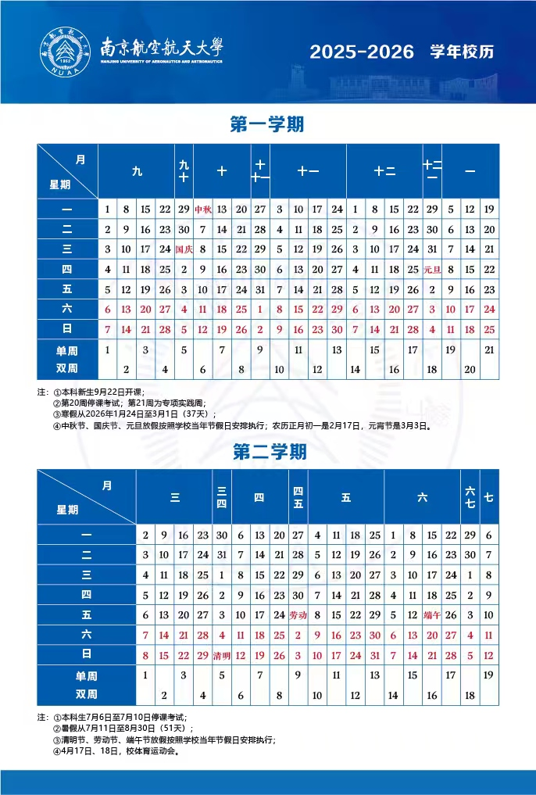

# 2025 - 2026 学年校历

> 搬运者注：这里原来作者的是24-25的校历，这里直接搬运教务处的

> 来自[南航教务处](https://aao.nuaa.edu.cn/8225/list.htm)

- **将军路校区、明故宫校区上课时间：** 
第一节 8:00-8:50 第二节 8:55-9:45 第三节 10:15-11:05 第四节 11:10-12:00 第五节 14:00-14:50  第六节 14:55-15:45  第七节 16:15-17:05  第八节 17:10-18:00 第九节 18:45-19:35  第十节 19:40-20:30  第十一节 20:35-21:25

- **天目湖校区上课时间**：

    - **第一批 教学楼（巡天楼、牧星楼、明慧楼）1-3层** 
    第一节 8:30-9:20 第二节 9:25-10:15 第三节 10:25-11:15 第四节 11:20-12:10 第五节 14:00-14:50 第六节 14:55-15:45 第七节 16:00-16:50 第八节 16:55-17:45 第九节 18:45-19:35 第十节 19:40-20:30  第十一节 20:35-21:25

    - **第二批 教学楼（巡天楼、牧星楼）4-5层** 
    第一节 8:30-9:20 第二节 9:25-10:15 第三节 10:40-11:30 第四节 11:35-12:25 第五节 14:00-14:50 第六节 14:55-15:45 第七节 16:00-16:50 第八节 16:55-17:45 第九节 18:45-19:35 第十节 19:40-20:30  第十一节 20:35-21:25

