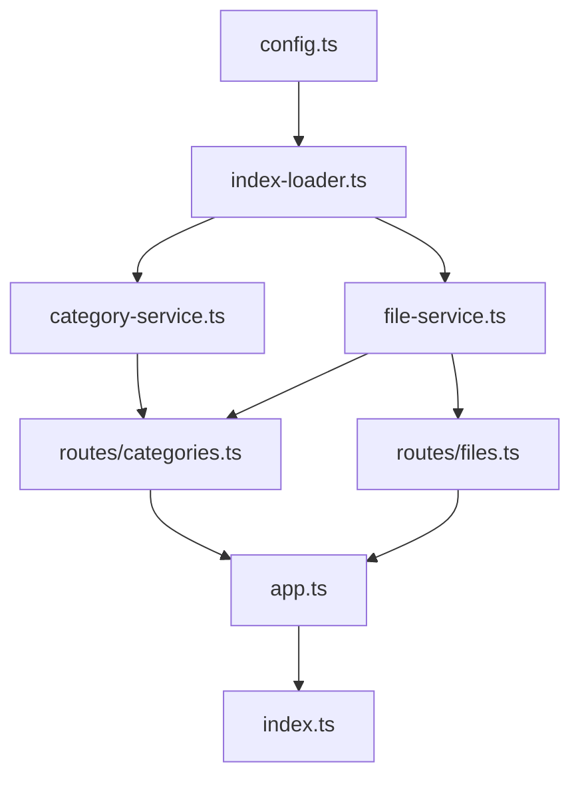

# 后端接口实现设计

更新日期：2025-10-25

## 目标

- 基于 Fastify 提供统一的 REST 接口：
  - `GET /api/v1/categories` 返回全部分类列表。
  - `GET /api/v1/categories/:id/files` 返回某一分类下的文件。
  - `GET /api/v1/files/:id` 返回单个文件详情（包含同目录关联信息）。
- 复用前置索引生成流程（`web/public/index.json`、`categories.json`），在 Serverless/Vercel 环境下以只读方式加载。
- 保持模块化边界，方便在未来扩展缓存策略、增量刷新、权限检查等需求。

## 约束与假设

- 所有索引数据在部署前由 `tools/indexer` 构建完成，并被同步上传到部署包的 `web/public/` 或 `api/public/` 目录。
- 后端运行在无状态环境（Vercel Serverless 函数或本地开发环境）。
- 请求量较小，首次请求允许冷启动期间进行一次文件读取与解析；后续请求应尽量命中内存缓存。

## 模块划分与优先级

| 模块                           | 角色                                                                                            | 关联                                         | 优先级 |
| ------------------------------ | ----------------------------------------------------------------------------------------------- | -------------------------------------------- | ------ |
| `config.ts`                    | 常量、路径推导与环境配置，集中记录索引文件候选路径、缓存 TTL                                    | 被 Loader、Service 依赖                      | P0     |
| `loaders/index-loader.ts`      | 负责读取 `index.json`/`categories.json`，实现内存缓存与文件时间戳比较                           | 调用 `config.ts`，被 Service 使用            | P0     |
| `services/category-service.ts` | 基于 Loader 的数据提供类别列表、查找、统计等业务逻辑                                            | 使用 `index-loader`，被 Routes 调用          | P0     |
| `services/file-service.ts`     | 提供文件级查询、按分类过滤、相邻文件等逻辑                                                      | 使用 `index-loader`，被 Routes 调用          | P0     |
| `routes/categories.ts`         | 注册 `/api/v1/categories` 与 `/api/v1/categories/:id/files` 路由，将请求参数转换为 Service 调用 | 依赖 Category/File Service，供 `app.ts` 注册 | P1     |
| `routes/files.ts`              | 注册 `/api/v1/files/:id` 路由，封装响应格式                                                     | 依赖 File Service，供 `app.ts` 注册          | P1     |
| `app.ts`                       | Fastify 实例工厂，串联配置、加载器、路由注册；负责健康检查、错误处理、插件装配                  | 引入全部 Routes/Services                     | P1     |
| `index.ts`                     | 启动入口（保持现有文件，后续迁移至基于 `app.ts` 启动），提供 `start()` 与导出实例               | 引用 `app.ts`                                | P2     |
| `tests/**/*`                   | API 层测试，验证合同、缓存行为、错误路径                                                        | 依赖所有模块                                 | P2     |

> **优先级说明**：
>
> - **P0**：必须先完成，属于后续模块的基础；需在开发第一阶段实现。
> - **P1**：在 P0 可用后立即实现，使 API 达到可提供数据的状态。
> - **P2**：增强稳定性与上线体验，可在 API 可用后再补齐。

## 模块协作流程

## 数据流说明

1. Fastify 实例通过 `config.ts` 计算索引文件候选目录（`api/public`, `web/public`）。
2. 首次调用 Loader 时会从候选路径读取 JSON，解析为 `IndexManifest` 与分类列表，随后缓存于内存。
3. Service 层仅关心结构化数据：
   - Category Service 提供 `listCategories()`、`getCategory(id)`、`listFiles(id)`（委托给 File Service）。
   - File Service 提供 `listAll()`、`findById()`、`filterByCategory()`，并可拓展排序/分页。
4. Route 层负责请求校验、调用 Service、统一响应格式（`{ data, meta }`）。
5. `app.ts` 在实例化 Fastify 时注册健康检查、通用插件（CORS、压缩、缓存头），并主动注入 Service 到请求上下文（可使用 Fastify Decorator）。
6. `index.ts` 作为启动入口，可被 Serverless 载入或本地开发脚本执行。

## 实现优先顺序

1. **阶段一**：完成 `config.ts`、`index-loader.ts`，确保能在 Node 环境加载索引文件并缓存。
2. **阶段二**：实现 Category/File Service 的核心查询逻辑，编写单元测试验证。
3. **阶段三**：实现路由模块，接入 `app.ts` 与 `index.ts`，提供健康检查、错误处理。
4. **阶段四**：补充缓存失效策略、测试、脚本与文档（P2）。

## 后续考虑

- 支持按需刷新缓存（例如通过查询参数或后台 webhook）。
- 引入 schema 校验（`@fastify/ajv-compiler`）确保响应结构一致。
- 对接前端分类、搜索接口，提供分页与排序能力。
