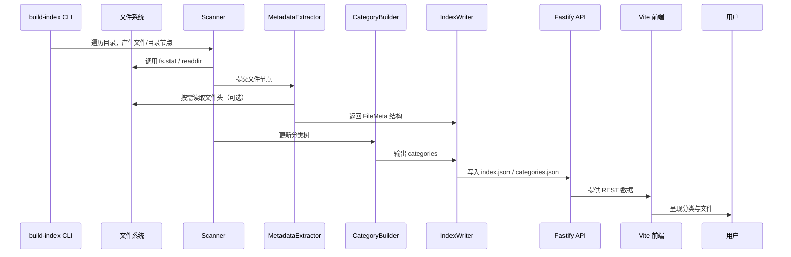

# 文件索引与元数据提取设计文档

更新日期：2025-10-25

## 目标与范围

- 自动遍历仓库内的资料目录，生成统一的分类树与文件索引 JSON。
- 抽取每个文件的基础元数据（名称、路径、大小、修改时间、扩展名、MIME、可选标题摘要）。
- 将生成结果存放于 `web/public/index.json` 与 `web/public/categories.json`（或 `api/public/`），供前端和 Fastify API 使用。
- 初期采用构建时离线生成（可通过 CLI/脚本触发），后期保留扩展到增量更新或 Serverless 动态生成的空间。

不在本阶段处理：文件内容全文索引、权限过滤、用户自定义标签持久化。

## 输入输出契约（Contract）

- **输入**：仓库目录（默认仓库根），忽略 `.git`, `node_modules`, `api`, `web` 等自定义排除列表。
- **输出**：
  - `index.json`
    ```json
    {
    	"generatedAt": "2025-10-25T08:00:00.000Z",
    	"files": [
    		{
    			"id": "课程Course/数学分析/笔记.md",
    			"name": "笔记.md",
    			"path": "课程Course/数学分析/笔记.md",
    			"categoryId": "课程Course/数学分析",
    			"ext": ".md",
    			"mime": "text/markdown",
    			"size": 12345,
    			"modifiedAt": "2024-08-01T12:30:00.000Z",
    			"title": "数学分析笔记",
    			"digest": "极限与连续性……"
    		}
    	]
    }
    ```
  - `categories.json`
    ```json
    [
    	{
    		"id": "课程Course",
    		"name": "课程Course",
    		"path": "课程Course",
    		"parentId": null,
    		"childrenCount": 141
    	}
    ]
    ```
- **错误输出**：脚本运行错误时返回非零退出码，并打印 JSON/表格化日志。

## 架构分层

1. **文件扫描器 (Scanner)**：深度遍历目录，生成 `DirectoryEntry`（包含路径、stat 信息、文件/目录标记）。
2. **元数据提取器 (MetadataExtractor)**：
   - 使用扩展名映射 MIME 类型；
   - 对 Markdown / TXT 获取首行标题；
   - 对 DOCX/PPTX/PDF 可选使用轻量库（后续阶段）。
3. **分类树构建器 (CategoryBuilder)**：
   - 根据路径层级生成树结构，去重并计算 `childrenCount`。
4. **索引组合器 (IndexComposer)**：
   - 汇总文件列表 + 分类信息；
   - 生成摘要字段（如必要可后续支持缓存/分批写入）。
5. **输出写入器 (Writer)**：
   - 将 JSON 写入目标目录；
   - 可选生成 MD5 校验；
   - 返回写入报告供 CLI 显示。

## Mermaid 信号流 / 时序图



## 模块设计细节

### Scanner

- 递归遍历，使用 `fs.promises.opendir` / `dirent`。
- 可配置忽略列表（`.git`, `node_modules`, `web`, `api`, `.DS_Store` 等）。
- 返回 `Iterable<DirectoryEntry>`；对于大型目录可采用生成器逐步消费。

### MetadataExtractor

- 输入：`DirectoryEntry` + 基础 stat。
- 输出：
  ```ts
  interface FileMeta {
  	id: string; // path
  	name: string;
  	path: string;
  	categoryId: string;
  	ext: string;
  	mime: string;
  	size: number;
  	modifiedAt: string;
  	title?: string;
  	digest?: string;
  }
  ```
- MIME 识别优先使用 `mime-types` 包；标题抽取针对 `.md` `.txt` 读取首行。

### CategoryBuilder

- 根据文件路径的目录部分生成 `CategoryNode`。
- `id` 采用路径字符串（统一使用 `/`）。
- 统计 `childrenCount` 与 `fileCount`（可选）。

### IndexWriter

- 接收所有 `FileMeta` 与分类树，排序后写入。
- 输出文件默认位于 `web/public/`。若目录不存在则自动创建。
- 所有 JSON 使用 UTF-8，带缩进（默认 2 空格）。

### CLI 入口

- 暂定放在 `tools/build-index.ts`（TypeScript + ts-node/tsx）。
- CLI 参数：
  - `--root <path>` 指定扫描根目录（默认仓库根）。
  - `--out <path>` 指定输出目录。
  - `--formats categories,index` 控制输出文件。
  - `--pretty` 是否格式化 JSON。
- 日志使用 `pino` 或 `console`，支持 `--verbose`。
- CLI 默认会根据脚本位置推导仓库根目录，并将 `--out` 视作相对于 `--root` 的路径，因此在 `tools/` 目录内执行同样会把 JSON 写入 `<repo>/web/public`，无需额外参数。
- Vercel 部署时，可在构建命令前增加 `npm --prefix tools install && npm --prefix tools run build:index`（或等效工作流脚本），确保最新索引在 `web/public` 下生成后再执行 `web` 前端的构建。

## 文件与模块对应关系

- `tools/indexer/types.ts`
  - 声明核心类型：`DirectoryEntry`、`FileMeta`、`CategoryNode`、`IndexManifest` 等。
  - 其他模块全部只依赖类型定义，不直接相互引用。
- `tools/indexer/constants.ts`
  - 维护全局常量：忽略目录名单、默认并发数、输出文件名、MIME 映射表等。
  - Scanner、MetadataExtractor、IndexWriter 通过此处的常量共享配置。
- `tools/indexer/scanner.ts`
  - 导出 `scanDirectory(root, options)` 生成器，产出 `DirectoryEntry`。
  - 依赖 `types.ts`（类型）与 `constants.ts`（忽略目录）。
- `tools/indexer/metadata-extractor.ts`
  - 导出 `extractMetadata(entry, root)`，将 `DirectoryEntry` 转换为 `FileMeta`。
  - 使用 `mime-types` 库与 `constants.ts` 的扩展名配置。
- `tools/indexer/category-builder.ts`
  - 提供 `buildCategories(files: FileMeta[])`，根据文件路径生成分类树数组。
  - 仅依赖 `types.ts`。
- `tools/indexer/index-composer.ts`
  - 聚合 `FileMeta[]` 与 `CategoryNode[]`，生成最终的 `IndexManifest`。
  - 负责排序、去重、统计摘要。
- `tools/indexer/index-writer.ts`
  - 写入 JSON 文件、生成目录并输出统计信息。
  - 依赖 Node `fs/promises` 与 `constants.ts` 的默认输出路径。
- `tools/indexer/build-index.ts`
  - CLI 入口：解析命令行参数，顺序调用 Scanner → MetadataExtractor → CategoryBuilder → IndexComposer → IndexWriter。
  - 负责流程控制与错误处理，并在必要时调用 `process.exit(code)`。

模块协作顺序：

1. `build-index.ts` 读取参数，设置上下文。
2. `scanner.ts` 产出文件节点，逐条传入 `metadata-extractor.ts`。
3. 提取出的 `FileMeta` 集合传入 `category-builder.ts` 与 `index-composer.ts`。
4. `index-writer.ts` 将结果持久化为 `index.json` 与 `categories.json`。
5. 后续 Fastify API 读取上述 JSON，实现与前端联动。

## 性能与可扩展性

- 基于异步遍历 + Promise 并发控制（默认同时处理 8~16 个文件）。
- 对大文件仅读取必要部分（如前 4KB）。
- 结果可缓存（生成 hash），后续支持增量更新。
- 运行时间估计：以 10k 个文件计，纯 Node.js 遍历约数秒内完成。

## 错误处理与日志

- 文件读取失败：记录 warning 并跳过该文件。
- JSON 写入失败：立即抛错并退出非 0 状态。
- 输出结构需通过 JSON schema 校验（可使用 `ajv` 进行自检）。

## 安全与过滤

- 默认忽略敏感目录（可在配置文件中维护白/黑名单）。
- 输出路径限制在项目内，防止路径穿越。
- 后续如需隐藏特定文件，可在配置中列出模式。

## 测试方案

### 单元测试

- `Scanner`：
  - 模拟带嵌套目录的临时文件系统，验证遍历数量与忽略规则。
- `MetadataExtractor`：
  - 针对 `.md`, `.txt`, `.pdf`（mock）测试标题抽取；
  - 验证 MIME 映射正确性。
- `CategoryBuilder`：
  - 输入多个路径，检查生成树与 `parentId`、`childrenCount`。

### 集成测试

- 使用临时目录构建迷你仓库（含中英文目录、强调特殊字符）。
- 运行 CLI，读取生成的 `index.json`/`categories.json` 并通过 schema 校验。
- 验证 `index.json.files` 中随机样本的 `categoryId`、`size`、`modifiedAt` 与实际文件一致。

### 接口契约测试

- 启动 Fastify API（使用生成的 JSON），通过 supertest/swr 调用：
  - `GET /api/v1/categories` 返回非空数组；
  - `GET /api/v1/categories/:id/files` 返回文件列表，与原 JSON 对齐。

### 性能测试（可选）

- 构造包含 1 万个空文件的目录，测算 CLI 总耗时，确保在 10 秒内完成（根据硬件适当调整目标）。

### 手工验证

- 在本地运行脚本后启动前端，确认分类树能正确显示。
- 随机选择几个文件验证下载/预览链接有效。

## 验收标准

- CLI 在仓库根运行能生成最新的 `index.json` 与 `categories.json`，结构符合 Contract。
- Fastify API 在读取新生成文件后，分类与文件接口返回的数据与 JSON 一致。
- 测试用例（单元 + 集成）全部通过。
- 运行日志包含统计：总文件数、忽略数量、耗时（ms）。

## 下一步计划

1. 编写 `tools/build-index.ts`，实现上述模块并配置脚本入口。
2. 添加基础测试（可用 Vitest/Jest）与 GitHub Actions/本地 npm script：`npm run build:index`。
3. 将 Fastify API 调用指向生成的 JSON，完善错误处理与缓存逻辑。
