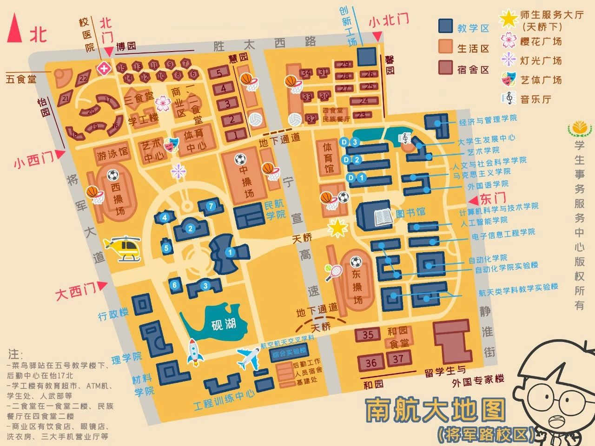
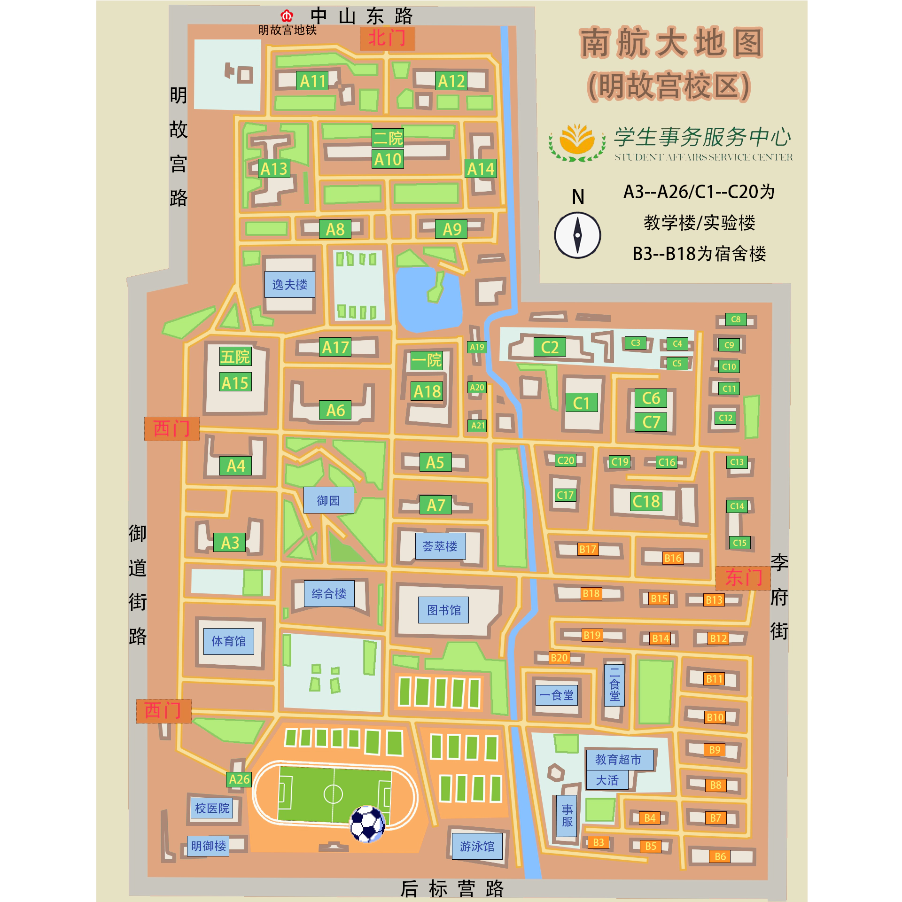
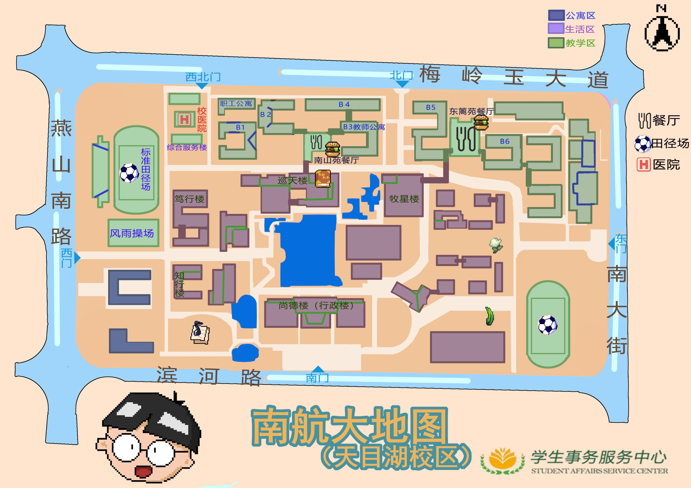

# 校园地图
上次更新：2024-8-29
## 一、校园地理信息系统（GIS）
### 1.渠道一

- [南京航空航天大学三维校园GIS|智慧校园可视化平台|校园地图|数字孪生校园 ↗︎](https://map.nuaa.edu.cn/)

- 预览如下

 

<figure>
<iframe class="notion-asset-object-fit" src="https://map.nuaa.edu.cn/" title="iframe embed" frameborder="0" allowfullscreen="" loading="lazy" scrolling="auto" data-ruffle-polyfilled=""></iframe>
</figure>

 

### 2.渠道二

- i南航  → 校园地图

## 二、平面地图
> 由 **微爷团队** 制作
### 将军路

### 明故宫

### 天目湖

